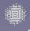
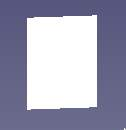

# Lighting

Lighting is an essential part of rendering. By default, templates contain some
standard basic lighting configurations (like environment or sun+sky lighting),
but you can add some more lights to enhance your rendering.

## How to add a light to your rendering

The general method to add a light to your rendering project is the following: 
1. Create the light object
2. Place the light in your scene (and orient it if applicable)
3. Tweak the light power and color
4. **Add a view of the light in your project**. This is a mandatory step to
   have the light eventually rendered! Use  button, like for objects...

## Light types

The lights we support are very common ones in the rendering world. Therefore we
will only give a brief description for each of them: you may find more detailed
explanations in computer graphics literature or web contents, or in your
renderer documentation.

### Point light

The point light is an omni-directional point of light, meaning that it is
infinitely small and emits light equally in all directions, similar to a light
bulb or a candle flame.

#### Creation

To create a point light, press the corresponding button in toolbar: 

Do not forget to add a view of your light to your rendering project.

#### Representation in FreeCAD

In FreeCAD viewport, point light will be represented by a dashed "star":

The size of the star is controlled by the `Radius` parameter, which should be
useful to adapt the light representation to your scene dimensions.  Please note
this parameter is just dedicated to viewport seeing, and has *no effect on
rendering*. 

The representation in FreeCAD viewport casts light onto objects, but this is just
for convenience and does not prejudge the final rendering.

#### Special parameters

Point light is the most basic light, there is no special parameter.

### Area light

The area light is a rectangle emitting light on all its surface in the
direction of its normals.

#### Creation

To create an area light, press the corresponding button in toolbar: 

Do not forget to add a view of your light to your rendering project.

#### Representation in FreeCAD

In FreeCAD viewport, an area light will be represented by a luminous rectangle:

The representation in FreeCAD viewport casts light onto objects, but this is just
for convenience and does not prejudge the final rendering.

#### Special parameters

The size of the rectangle is determined by `Size U` and `Size V`
parameters. Those parameters influence the rendering, as they are exported to
the renderer as the dimensions of the area light to render.

Please note that the `Power` parameter refers to the power of the whole area,
and not to the power per unit area. For renderers using a power per unit area
(like Appleseed), a conversion is made when exporting.

Orienting an area light in a scene may be quite painful. To alleviate such a
task, you will find a `Point at...` feature in the contextual menu of the
light. Trigger `Point at...`, select the object your area should point at, and
the workbench will orient automatically the area to the object.

### Sun & sky light

Sun & sky light simulates a solar and atmospheric lighting, as existing at
Earth's surface. It will consist into 2 parts: the direct sunlight (a direct
light altered by atmospheric scattering) and the skylight (an environment light
resulting from indirect sunlight diffusion). Sun & sky is particularly useful
in architectural rendering.

#### Creation

To create a sunsky light, press the corresponding button in toolbar: 

Do not forget to add a view of your light to your rendering project.

#### Representation in FreeCAD

There is no representation of sun & sky light in FreeCAD viewport.

#### Special parameters

The `Sun direction` parameter controls the position of the sun in the simulated
sky. It is a vector representing the direction of the sun as seen from an
observer on Earth.  A few things to keep in mind with this parameter:
* `Sun direction` should not be a null vector.
* Negative z component (sun under horizon) may create issues with some renderers.

The `turbidity` parameter controls atmospheric turbidity. Values < 2 may create
issues with your renderer.  Refer to your renderer documentation, or general
documentation on sky simulation, for more information.

#### Caveat

Sun & sky light is a complex feature to implement in a renderer.  Nowadays,
efficient renderers generally use Hošek-Wilkie model to render such a lighting:
this is the case for Appleseed and LuxCore, for instance. In other renderers,
the support may be partial (Cycles: only sky is correctly implemented) or
inexistent (Povray); in which case, an approximate method will still be
employed in the workbench to compensate the missing feature, but the result
might be less realistic.

### Image-based light

Image-based lighting is a lighting technique based on projecting an
omnidirectional picture of an environment onto a dome surrounding the scene.

#### Creation

To create a image-based light, press the corresponding button in toolbar: 

Do not forget to add a view of your light to your rendering project.

#### Representation in FreeCAD

There is no representation of image-based light in FreeCAD viewport.

#### Special parameters

`Image File`: the file containing the image to use (should be a HDR). Please
note the image file is embedded into the FreeCAD file.

## Additional remarks

* The final effect of a light in a rendering directly depends on the renderer's
  capabilities.  The effect of a light may vary a lot from one renderer to
  another. The only way to get it right is to try and experiment...
* Just like other objects, the light will be exported to the renderer only if
  its `Visibility` is set to `True`.
